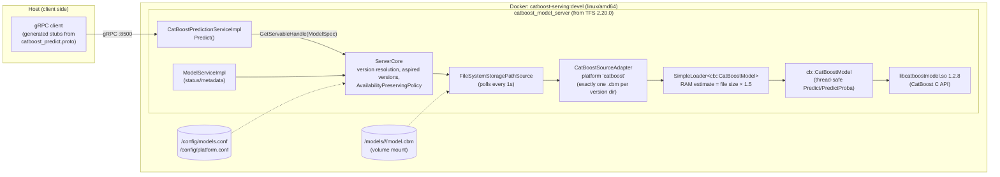

# CatBoost on TensorFlow Serving — Architecture & Test Report

Date: 2026-08-16 · Repo: `catboost-serving2` · Result: **all acceptance criteria met**

## Direct answers first

**Was an actual TF Serving server built?** Yes. `catboost_model_server` is a real
custom server binary compiled from the **TensorFlow Serving 2.20.0 source tree**
(the latest release). It links TFS's production components — `ServerCore`,
the model-version lifecycle manager, `AvailabilityPreservingPolicy`, filesystem
polling, `ModelService` — plus our additions: a registered `catboost` platform
(source adapter) and a dedicated gRPC prediction service. Nothing is mocked and
`tensorflow_serving/` itself is unpatched (everything is additive).

**Were actual CatBoost models deployed?** Yes. Three genuinely trained models
(CatBoost 1.2.8, `.cbm` format) were deployed into the standard TFS model
repository layout (`/models/<name>/<version>/model.cbm`) and served. Their
predictions over gRPC were compared bit-for-close (rtol 1e-6) against the same
models evaluated by Python CatBoost — raw values and probabilities.

**Where was it deployed?** A local Docker container (linux/amd64) on the dev
Mac, with the model repository and configs volume-mounted and gRPC exposed on
`:8500` — i.e. a faithful single-node replica of a production TFS deployment.
It has **not** been deployed to a remote production environment; the
"Production reproduction" section below covers exactly what carries over and
what to harden first.

**Can the test be reproduced with your own real models?** Yes — any model your
training pipeline saves with `model.save_model(path, format="cbm")` drops into
the same layout with one config entry. Steps below.

## What was built (versions as tested)

| Component | What it is | Version |
|---|---|---|
| `catboost_model_server` | custom TFS server binary (gRPC) | built from TFS **2.20.0** sources |
| `CatBoostSourceAdapter` | TFS platform `"catboost"`: version dir → loaded servable | ours |
| `CatBoostPredictionService` | gRPC API: positional numeric + string categorical rows | ours (`tfs/proto/catboost_predict.proto`) |
| `cb::CatBoostModel` | thread-safe RAII wrapper over CatBoost C API | ours |
| `libcatboostmodel.so` | official prebuilt CatBoost inference library | **1.2.8** (sha256-pinned) |
| Fixture models | really trained regression / binary / multiclass models | CatBoost 1.2.8, seed 42 |
| Build | Bazel 9.2.0 (L1 module) / TFS-pinned Bazel in `tensorflow/serving:2.20.0-devel` (L2) | image is amd64-only |

## Architecture as tested



**Request path (per Predict call):**
1. Client sends `CatBoostPredictRequest{model_spec, rows[], output_probabilities}`.
2. `GetServableHandle` resolves the version ("latest" if unset), returns a
   ref-counted handle — requests in flight are safe across hot reloads.
3. Rows are marshalled into float / categorical-string matrices; the wrapper
   validates shapes (exact feature counts, matching batch sizes) before
   touching the C API, so malformed input returns `INVALID_ARGUMENT`, never a
   crash.
4. One `CalcModelPrediction` call evaluates the whole batch; categorical
   features are passed as raw strings and hashed inside CatBoost — identical
   semantics to Python, including categories never seen in training.
5. Response: row-major `values[rows × dimension]`, the dimension, and the
   **actually served version** echoed back.

**Model lifecycle:** dropping `/models/<name>/<N+1>/model.cbm` is detected by
the 1s filesystem poll → adapter builds a loader → `AvailabilityPreservingPolicy`
loads N+1 before unloading N (no downtime) → subsequent responses echo version
N+1. Verified live in the e2e test.

## The models that were deployed

| Model | Task | Features | Output dim | Training data |
|---|---|---|---|---|
| `numeric_only` | regression | 5 float | 1 | 2000 rows, `y = 3x₀ − 2x₁ + x₂x₃ + ε`, 50 iters |
| `categorical_only` | binary classification | 3 categorical (color, size, 20 cities) | 1 (logit) | 3000 rows, label from category combos + 5% noise, 60 iters |
| `mixed_multiclass` | 3-class (`MultiClass`) | 4 float + 2 categorical | 3 | 3000 rows, class from mixed score, 60 iters |

Golden references: 8 fixed input rows per model — including a row with
categories never seen in training (`"purple"/"XXL"/"atlantis"`,
`"hexagon"/"carbon"`) and extreme floats (±1e6, ±1e−8) — with Python outputs of
both `predict(prediction_type='RawFormulaVal')` and `predict_proba`, committed
as `cb/testdata/expected_predictions.json`.

## Test evidence

| # | Test | Where it ran | Result |
|---|---|---|---|
| 1 | `LoadReportsCorrectShapes` — feature counts + dimension for all 3 models | macOS arm64 · Linux aarch64 · Linux x86_64 | PASS |
| 2 | `NumericOnlyMatchesPython` — 8 rows vs golden, rtol 1e-6 | same 3 platforms | PASS |
| 3 | `CategoricalOnlyMatchesPython` — raw + sigmoid proba, incl. unseen categories | same | PASS |
| 4 | `MixedMulticlassRawAndProbaMatchPython` — 8×3 raw + softmax; rows sum to 1 ± 1e-9 | same | PASS |
| 5 | `BatchEqualsRowByRow` — batch output == concatenated single rows, exact | same | PASS |
| 6 | `InvalidInputsRejectedNotCrashing` — wrong arity / ragged batch / empty / missing / garbage file | same | PASS |
| 7 | `ConcurrentPredictIsSafe` — 8 threads × 200 predictions, all golden | same | PASS |
| 8 | `catboost_source_adapter_test` (4 cases: loads + predicts golden, RAM estimate, 0-cbm dir, 2-cbm dir) | inside the TFS Docker image | PASS |
| 9 | **E2E**: all 3 models served over real gRPC, raw + proba vs golden | container ↔ host | PASS |
| 10 | **E2E hot swap**: copy model to `/2/`, version flips 1→2 with no restart, still golden | container ↔ host | PASS |

E2E topology (`docker/e2e/run_e2e.sh`): stages models + configs in a temp dir →
`docker run -p 8500:8500 -v models -v config` → generates Python stubs with
`grpc_tools.protoc` → asserts predictions → writes version 2 into the live
model repo → polls until the echoed version flips.

## Reproducing with your own production models

1. **Export** from your training pipeline: `model.save_model("model.cbm", format="cbm")`.
   Record the feature order — the serving API is positional (numeric in float-feature
   order, categorical in cat-feature order, exactly as at training time).
2. **Lay out** the repository: `<base_path>/<model_name>/1/model.cbm` (exactly
   one `.cbm` per version directory).
3. **Configure**: add an entry to `models.conf` with
   `model_platform: "catboost"`; `platform.conf` ships unchanged.
4. **Run** the image (or your registry copy of it):
   `docker run -p 8500:8500 -v <repo>:/models -v <cfg>:/config catboost-serving:devel`.
5. **Call it** from any gRPC language — stubs generate from
   `tfs/proto/catboost_predict.proto` + the vendored `model.proto`
   (see `run_e2e.sh` for the exact protoc invocation), or use `grpcurl`.
6. **Roll out** a new version by writing `<name>/<N+1>/model.cbm` — picked up
   within `--file_system_poll_wait_seconds` (default 1s), availability
   preserved. **Roll back** by pinning `model_spec.version` in requests or
   removing the bad version dir. **Verify** which version answered via the
   echoed `model_spec.version` in every response.

## Honest production-readiness gaps (v1)

- **Image**: the tested image is the 25 GB devel image (contains the whole
  toolchain). For production, add a multi-stage step copying
  `/usr/local/bin/catboost_model_server` + `/usr/local/lib/libcatboostmodel.so`
  onto a slim `ubuntu:22.04` base — the binary is self-contained beyond that
  one `.so` (this was explicitly verified with `ldd`).
- **Platform**: amd64 image only (upstream TFS images are amd64-only). Deploy
  on x86_64 Linux; an aarch64 build would need a from-source TFS build.
- **Transport security**: gRPC is plaintext (`InsecureServerCredentials`); add
  TLS creds or terminate TLS at your ingress/mesh.
- **Not included by design (spec v1 non-goals)**: REST API, batching scheduler,
  GPU, text/embedding features.
- **No load/perf test yet**: correctness under 8-thread concurrency is verified;
  throughput/latency under production traffic is not.
- **Positional features**: the server validates feature *counts* with clear
  errors, but cannot detect two same-typed features swapped by the client.
  Follow-up: read feature names from the model (the C API exposes them) and
  optionally accept named features.
- **Observability**: TFS `ModelService` status is wired; Prometheus-style
  metrics endpoints are not.

## Repo map & milestones

```
cb/                  L1: wrapper + THE unit test + trained fixtures (no TF deps)
third_party/         vendored CatBoost C headers; sha256-pinned binaries via Bazel
tfs/                 L2: protos, source adapter (+test), gRPC service, main.cc
docker/              Dockerfile.devel, workspace_append, e2e harness
docs/                SPEC.md (design), this report
```

Commits: fixtures → L1 green (mac) → L2 code → README/CI → runtime `.so` fix.
The one integration bug found during deployment testing: the binary's
`DT_NEEDED` is plain `libcatboostmodel.so`, resolved via Bazel's rpath, which
breaks when the binary is copied out of `bazel-bin`; fixed by installing the
`.so` system-wide in the image (`ldconfig`).
